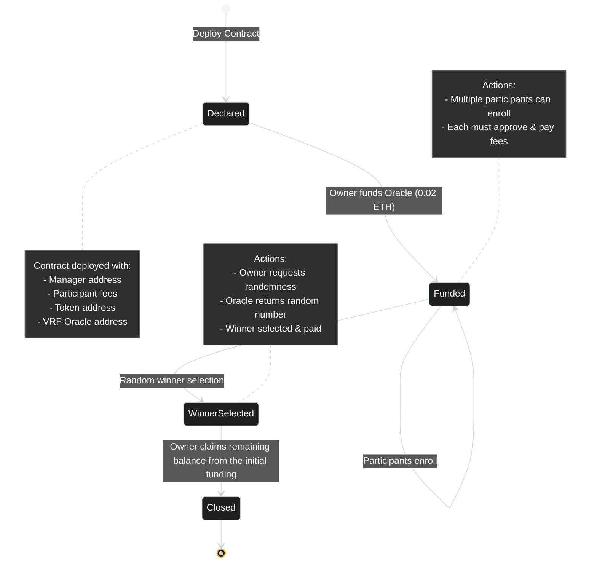

## Lottery Contract on StarkNet  

This Lottery Contract, built on StarkNet, leverages the Pragma VRF Oracle for secure and verifiable randomness. It allows participants to enroll in a fair lottery system, where the winner is determined by an unbiased random number generated on-chain. The contract is designed to ensure transparency and trust in the selection process, with efficient state transitions from declaration to closure.  


## Workflow  

The Lottery Contract follows a streamlined workflow to ensure transparency and fairness:  

1. **Deployment & Initialization**  
   - The contract is deployed by the owner, initializing its state as `Declared`.  

2. **Funding the Contract**  
   - The owner funds the contract by first approving a transfer of `0.02 ETH` and then calling the `fund_oracle_fees` function.  
   - The contract state transitions to `Funded`.  

3. **Participant Enrollment**  
   - Participants enroll by approving the transfer of the participation fee and invoking the `enroll` function.  

4. **Requesting Randomness**  
   - The owner can call the `request_randomness_from_pragma` function to request a random number from the Pragma VRF Oracle.  
   - The Oracle responds via the `receive_random_words` function, providing a random number to select the winner.  
   - The winnings are transferred to the winner, and the contract state changes to `WinnerSelected`.  

5. **Owner Withdrawal**  
   - The owner withdraws any remaining oracle funding fees, and the contract transitions to the `Closed` state.  

## Workflow Visualization  



## Deploying the Contract

### System Requirements
- Node.js 21.x or later
- scarb 2.9.2 

### Installation
1. Clone and enter the repository
```bash
cd lottery-starknet
```

2. Install dependencies
```bash
npm i
```

3. Build the smart contracts
```bash
scarb build
```

4. Environment Variables 

Create a `.env` file in the root folder with the following variables:
```env
DEPLOYER_PRIVATE_KEY=   # Your Starknet account private key
DEPLOYER_ADDRESS=       # Your Starknet account address
RPC_ENDPOINT=           # RPC URL (e.g. Infura or local node)
PARTICIPANT_FEE=        # Participant fee (in Wei)
```

5. Deploy the contract to Starknet
```bash
npm run deploy
```


