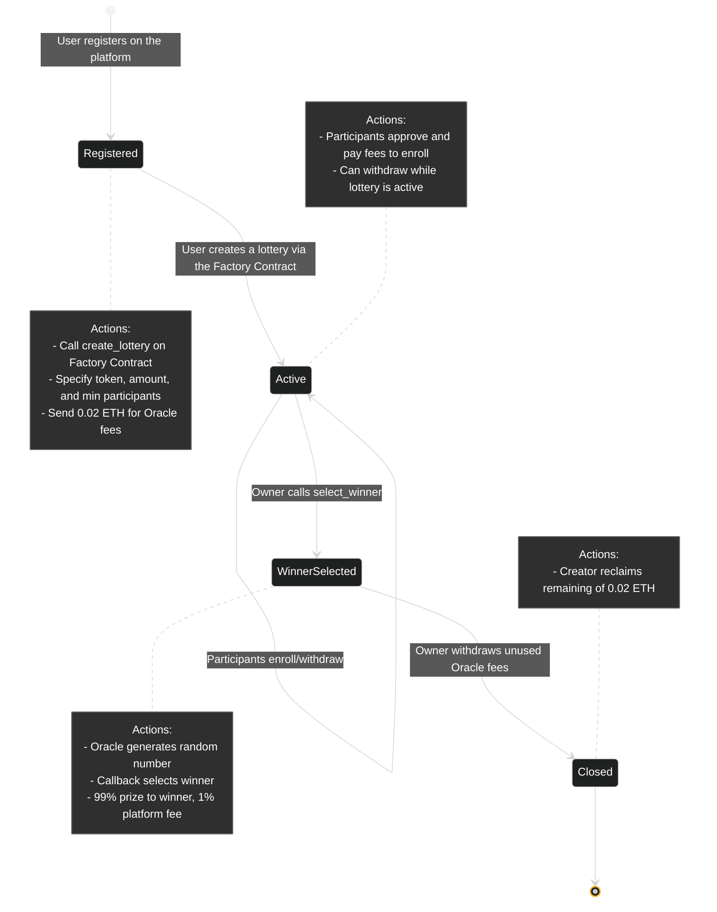
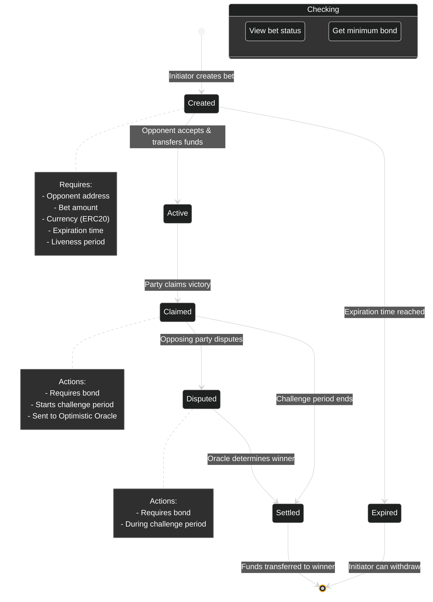

# Lucky Stark

Lucky Stark is an innovative on-chain lottery platform that ensures fairness and transparency by leveraging Pragma's VRF (Verifiable Random Function) oracle for true randomness. Users can create or participate in a variety of lotteries, fostering a dynamic and engaging ecosystem.

Additionally, we are working on introducing 1-on-1 betting between users, built on top of Pragma's Optimistic Oracle. This feature guarantees secure, decentralized, and trustless interactions for competitive betting.

## Key Features

- **True Randomness:** Powered by Pragma's VRF oracle, ensuring fairness in all lotteries.
- **Create & Join Lotteries:** Users can easily create custom lotteries or join existing ones.
- **1-on-1 Betting (Future):** Secure and transparent user-versus-user bets enabled by Pragma's Optimistic Oracle.
- **Decentralized & Trustless:** Built entirely on-chain to ensure transparency and security.

Lucky Stark aims to redefine how lotteries and peer-to-peer betting work in the decentralized space, ensuring fairness and trust at every step.

## Lotteries Workflow

The Lucky Stark platform follows a clear and transparent workflow to ensure fairness in all lottery operations.

### **1. User Registration**

Before participating, users must register on the platform by calling the `register_user` function. This step ensures a secure and personalized experience.

### **2. Creating Lotteries**

Lotteries can only be created through the Factory Contract, ensuring uniformity and accountability.

- Call the `create_lottery` function on the Factory Contract.
- Specify:
  - **Token:** The token to be used.
  - **Amount:** The participation fee.
  - **Minimum Participants:** The minimum number of participants required.
- The creator must send **0.02 ETH** to cover the cost of the Pragma VRF oracle fees:
  - Approximately **0.0003 ETH** is used for the oracle.
  - The remaining amount can be withdrawn after the lottery ends.

### **3. Lottery Participation**

Once a lottery is created, it enters the **Active** state:

- **Participants** can:
  - Enroll by paying the participation fee.
  - Withdraw their enrollment while the lottery is active.
- **Lottery Owner** manages the lottery and monitors participant count.

### **4. Winner Selection**

The lottery owner can call the `select_winner` function once the minimum number of participants is reached:

1. Sends a request to the Pragma VRF Oracle for a random number.
2. The Oracle responds by invoking the `receive_random_words` callback on the lottery contract.
3. The callback function:
   - **Distributes 99% of the total pool** to the randomly selected winner.
   - **Retains 1% as platform fees.**
4. The lottery state transitions to **Winner Selected**.

### **5. Finalization**

After the winner is selected:

- The lottery creator can call the `withdraw_oracle_fees` function to reclaim the unused portion of the **0.02 ETH** sent initially.
- The lottery is officially closed.

### **State Transitions**

1. **Active** → Open for participant enrollment.
2. **Winner Selected** → Winner determined and funds distributed.
3. **Closed** → Final state after oracle fees withdrawal.

This workflow ensures fairness, transparency, and an enjoyable experience for all participants.

## Lotteries Workflow Visualization



Factory Address:

```bash
0x02f5814a6a3c29855972b58ae15f7ba2afa86ceb69a1f992a371e299402ca0d3
```

# Betting Contract

This is a decentralized betting contract using an Optimistic Oracle to settle disputes. Participants can create, accept, and settle bets, with disputes resolved through an Oracle-driven process.

## Key Features

- Create custom bets between two participants.
- Resolve disputes using an Optimistic Oracle.
- Secure funds through a bonded challenge mechanism.
- Retrieve details of bets and their status.

## 1-on-1 Bets Workflow

1. **Create a Bet**

   - A user (`initiator`) proposes a bet against an `opponent`.
   - Parameters:
     - Opponent address
     - Bet amount
     - Currency (ERC20 token)
     - Expiration time
     - Liveness period (minimum 1 hour)
   - The `initiator` transfers the bet amount to the contract.

2. **Accept the Bet**

   - The `opponent` accepts the proposed bet.
   - The `opponent` transfers the same bet amount to the contract.

3. **Claim Victory**

   - Either party can claim victory by providing a reason and a bond.
   - The claim is sent to the Optimistic Oracle, starting the challenge period.

4. **Dispute Victory**

   - The opposing party can dispute the claim during the challenge period.
   - A bond is also required to initiate the dispute.

5. **Settle the Bet**

   - After the challenge period ends, the Oracle determines the winner.
   - Funds are transferred to the winner's address.

6. **Retrieve Bet Details**

   - Check the details of a bet, including its status, participants, and settlement.

7. **Check Minimum Bond**
   - Get the minimum bond amount for a specific currency.

## 1-on-1 Bets Workflow Visualization


